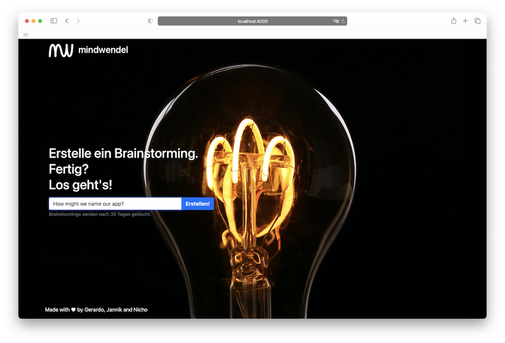

# mindwendel


Create a challenge. Ready? Brainstorm. mindwendel helps you to easily brainstorm and upvote ideas and thoughts within your team. Built from scratch with [Phoenix](https://www.phoenixframework.org).

## Features

- 5 minute setup (It is not a joke)
- Anonymously invite people to your brainstormings - no registration needed. Usernames are optional.
- Easily create and upvote ideas, with live updates from your companions.
- Cluster your ideas with custom labels
- Preview of links to ease URL sharing
- Export your generated ideas to html or csv (currently comma separated)
- German & English Translation files
- By default, brainstormings are deleted after 30 days to ensure GDPR compliancy.




## Use-cases

Brainstorm ...

- ... new business ideas
- ... solutions for a problem
- ... what to eat tonight
- ...

## Getting Started

mindwendel can be run just about anywhere. So checkout our [Installation Guides](./docs/installing_mindwendel.md) for detailed instructions for various deployments.

Here's the TLDR:

- Run mindwendel via Docker and reference your postgres database

  ```bash
  docker run -d --name mindwendel \
    -p 127.0.0.1:80:4000 \
    -e DATABASE_HOST="..." \
    -e DATABASE_PORT="5432" \
    -e DATABASE_SSL="false" \
    -e DATABASE_NAME="mindwendel_prod" \
    -e DATABASE_USER="mindwendel_db_user" \
    -e DATABASE_USER_PASSWORD="mindwendel_db_user_password" \
    -e SECRET_KEY_BASE="generate_your_own_secret_key_base_and_save_it" \
    -e URL_HOST="your_domain_to_mindwendel" \
    ghcr.io/mindwendel/mindwendel
  ```

NOTE: mindwendel requires a postgres database. You can use [our docker-compose file](./docs/installing_mindwendel.md#running-on-docker-compose) to also install the postgres.

## Contributing

To get started with a development installation of mindwendel, follow the instructions below.

mindwendel is built on top of:

- [Elixir](https://elixir-lang.org/install.html)
- [Phoenix Framework](https://hexdocs.pm/phoenix/installation.html#phoenix)
- [Phoenix LiveView](https://github.com/phoenixframework/phoenix_live_view)
- [PostgreSQL](https://www.postgresql.org)

### Development

- Startup docker-compose setup

  ```bash
  docker-compose up --build -d
  ```

- Setup the database

  ```bash
  docker-compose exec app mix ecto.setup
  ```

- Start the server

```bash
  docker-compose exec app mix phx.server
```

- Go to http://localhost:4000/

- Open you favorite editor and start developing

- Open a shell in the docker container to execute tests, etc.

  ```bash
  docker-compose exec app sh
  ```

- Go to http://localhost:4000/

### Testing

- Startup docker-compose setup

  ```bash
  docker-compose up --build -d
  ```

- Ensure your database is running and reset your database

  ```bash
  docker-compose exec app mix ecto.test.prepare
  ```

- Run the test

  ```bash
  docker-compose exec app mix test
  ```

### Production

- Generate self-signed ssl sertificate for the postgres server on the host machine; the generated files are mounted into the docker container

  ```bash
  mkdir -p ./ca
  openssl req -new -text -passout pass:abcd -subj /CN=localhost -out ./ca/server.req -keyout ./ca/privkey.pem
  openssl rsa -in ./ca/privkey.pem -passin pass:abcd -out ./ca/server.key
  openssl req -x509 -in ./ca/server.req -text -key ./ca/server.key -out ./ca/server.crt
  chmod 600 ./ca/server.key
  test $(uname -s) = Linux && chown 70 ./ca/server.key
  ```

- Duplicate and rename `.env.default`

  ```bash
  cp .env.prod.default .env.prod
  ```

- Adjust all configs in `.env.prod`, e.g. database settings, ports, disable ssl env vars if necessary

- Start everything at once (including a forced build):

  ```bash
  docker-compose --file docker-compose-prod.yml --env-file .env.prod up -d --build --force-recreate
  ```

- Open the browser and go to `http://${URL_HOST}`

#### Note

- The url has to match the env var `URL_HOST`; so http://localhost will not work when your `URL_HOST=0.0.0.0`
- The mindwendel production configuration is setup to enforce ssl, see Mindwendel.Endpoint configuration in `config/prod.exs`
- The mindwendel production configuration supports deployment behind a reverse porxy (load balancer) by parsing the proper protocol from the x-forwarded-\* header of incoming requests, see `config/prod.exs`

### Build release and production docker image

- Build the docker image based on our Dockerfile
  ```bash
  docker build -t mindwendel_prod .
  ```

### Formatting

We are using Elixir's built-in formatter.

- Check if the code is properly formatted
  ```bash
  mix format --check-formatted
  ```
- Automatically format the code
  ```bash
  mix format
  ```

## Environment Variables

### Localization

Currently, there are two language files available, german ("de") and english ("en"). To set the default_locale, you can set `MW_DEFAULT_LOCALE`. The default is english.

You can extract new strings to translate by running:

```bash
mix gettext.extract --merge
```

## Contributing

1. Fork it (<https://github.com/mindwendel/mindwendel/fork>)
2. Create your feature branch (`git checkout -b fooBar`)
3. Commit your changes (`git commit -am 'Add some fooBar'`)
4. Push to the branch (`git push origin fooBar`)
5. Create a new Pull Request

## Testimonials


kits is a project platform hosted by a public institution for quality
development in schools (Lower Saxony, Germany) and focusses on digital tools
and media in language teaching. mindwendel is used in workshops to activate
prior knowledge, and collect and structure ideas. In addition, mindwendel can
be found on https://kits.blog/tools and can be used by schools for free. More info on
how to use it can be found in this post https://kits.blog/digitale-lesestrategien-brainstorming/

Logos and text provided with courtesy of kits.

## Acknowledgements

- https://github.com/JannikStreek
- https://github.com/gerardo-navarro
- https://github.com/nwittstruck
- Lightbulb stock image by LED Supermarket at Pexels: https://www.pexels.com/de-de/foto/die-gluhbirne-577514/


## Additonal licence

The mindwendel [logo](https://thenounproject.com/icon/735650/) in this repo – created by [mikicon]https://thenounproject.com/mikicon) – is licenced under [CC BY 3.0 Unported](https://creativecommons.org/licenses/by/3.0/).
